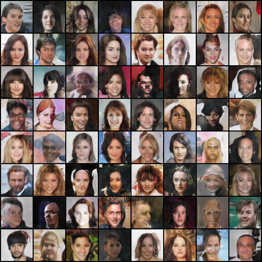
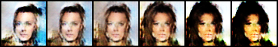

# DCGAN on CelebA — Latent Space Explorer

Training a DCGAN from scratch on the CelebA face dataset, then exploring the
latent space via interpolation and direction transfer.

## Overview

A from-scratch implementation of Deep Convolutional GAN (Radford et al., 2015)
in PyTorch, trained on celebrity faces at 64×64. The project covers the full
pipeline: data loading → adversarial training → evaluation → interactive app.

## Results

| Metric | Value |
|---|---|
| Training data | 202,599 CelebA images (12 epochs at 64×64) |
| Generator params | 3.58M |
| Discriminator params | 2.77M |
| FID (baseline model, 10k subset) | 123.17 |
| Final model quality | See sample grid below |

**Sample output (epoch 12):**

**Latent direction transfer** — applying `C + α·(B−A)` shows the latent space
encodes linear attribute directions:

## Architecture

**Generator** — noise `[B, 100]` → image `[B, 3, 64, 64]`
- 5 `ConvTranspose2d` blocks (channels 100→512→256→128→64→3)
- BatchNorm + ReLU in every block except the last
- Output activation: `tanh` (range `[-1, 1]`)

**Discriminator** — image `[B, 3, 64, 64]` → probability `[B, 1]`
- 5 strided `Conv2d` blocks (channels 3→64→128→256→512→1)
- LeakyReLU(0.2) in every block; BatchNorm in all but the first
- Output activation: `sigmoid`

Both models use DCGAN paper weight initialization (`N(0, 0.02)`).

## Training Details

- **Optimizer:** Adam, LR=2e-4, betas=(0.5, 0.999) — DCGAN paper values
- **Loss:** Binary cross-entropy (BCELoss)
- **Batch size:** 128
- **Label smoothing:** real labels set to 0.9 for stability
- **Augmentation:** random horizontal flip
- **Hardware:** Kaggle T4 GPU (~60 min for full training)

## Latent Space Explorer

- **Interpolation** — smooth morph between two random latent vectors
- **Direction transfer** — `C + α·(B−A)` produces consistent attribute shifts
- **Interactive app** — Gradio UI for on-demand generation, grids, and morphs

## Repo Structure

├── checkpoints/
│ ├── generator_final.pth # trained G weights (14 MB)
│ ├── history.json # per-epoch losses
│ └── results.json # summary metrics
├── assets/
│ ├── interpolation.gif # latent morph
│ ├── latent_arithmetic.png # direction transfer demo
│ └── samples/ # per-epoch grids
└── src/, notebooks/ # (reserved for code organization)

## How to Use

python
import torch
from model import Generator   # see notebook for class definition

G = Generator(z_dim=100, features_g=64).to("cuda")
ckpt = torch.load("checkpoints/generator_final.pth", map_location="cuda")
G.load_state_dict(ckpt["model_state_dict"])
G.eval()

z = torch.randn(1, 100, device="cuda")
with torch.no_grad():
    face = (G(z) + 1) / 2   # [-1,1] → [0,1] 

Honest Limitations
Resolution: 64×64 (128×128 would need ~4× longer training)

Training time: 12 epochs is sufficient for recognizable faces but
not for photorealistic quality — DCGAN papers typically train 25+ epochs

FID: final model FID not re-measured due to a torchmetrics/torch-fidelity
version conflict; baseline (10k subset) model scored 123.17

Color drift: mild saturation on some samples, a known DCGAN failure mode

Future Work
Train on 128×128 with progressive growing

Add conditional generation (Male/Smiling attributes from CelebA labels)

Replace DCGAN with a small diffusion model for higher fidelity

References
Radford, Metz, Chintala. Unsupervised Representation Learning with Deep
Convolutional Generative Adversarial Networks. ICLR 2016.

Liu et al. Deep Learning Face Attributes in the Wild. ICCV 2015 (CelebA).

Built as part of IITM BS — Deep Learning & Generative AI coursework.

